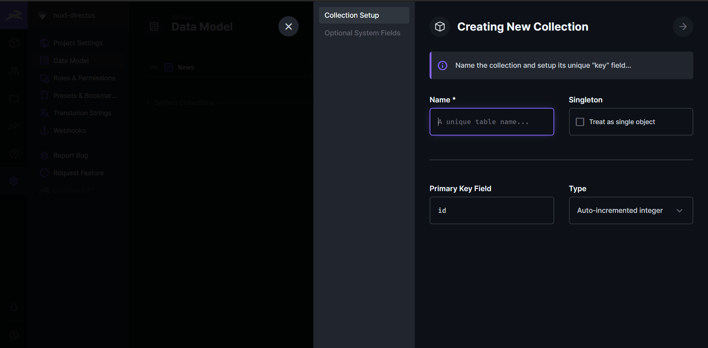
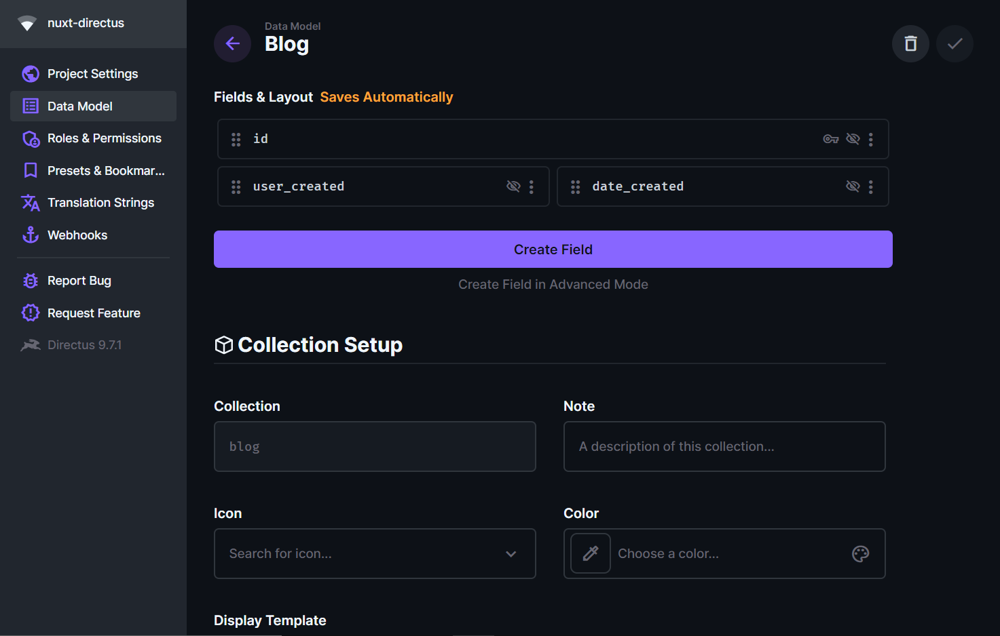
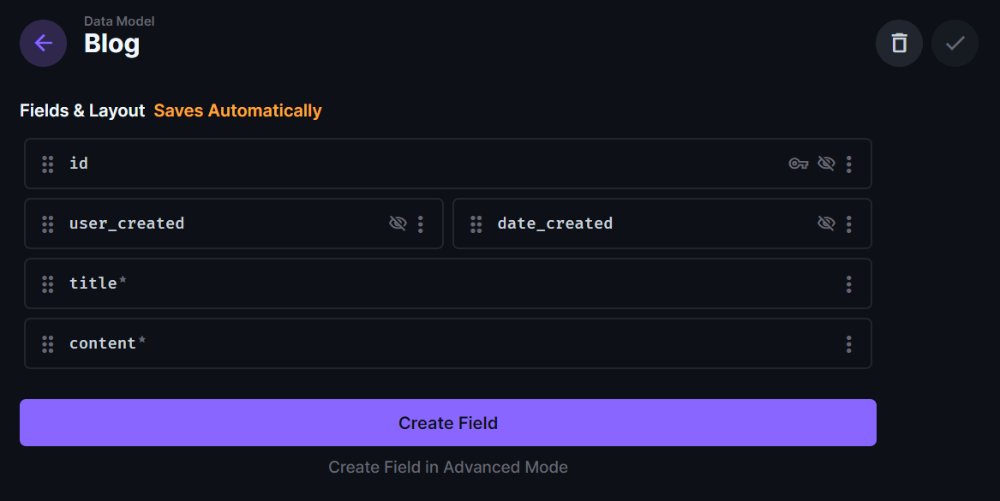
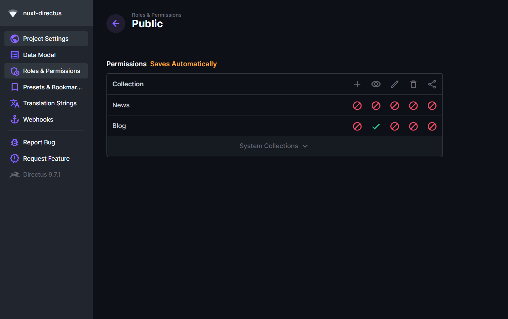
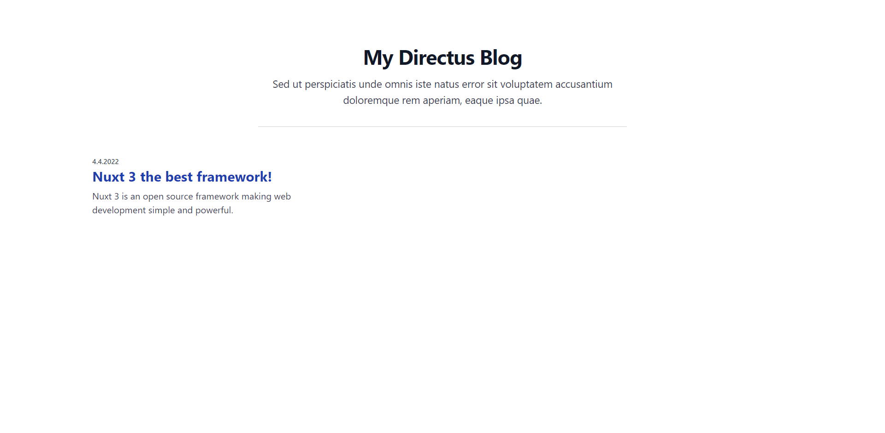
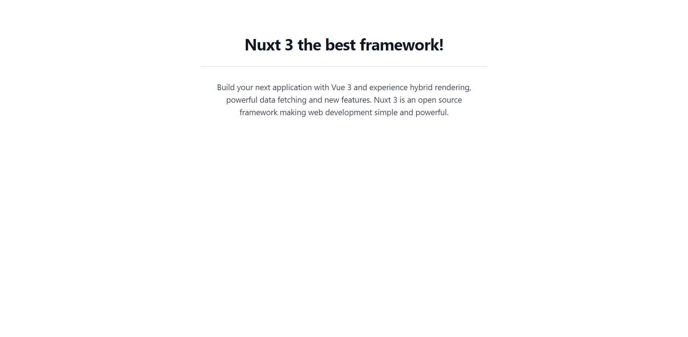

# Build a blog with Nuxt 3 & Directus

> This guide shows you how to build a blog with Nuxt 3 and Directus step by step.

### What is Nuxt 3?

Nuxt 3 is an open source framework making web development simple and powerful. With Vue 3 and experience hybrid rendering, powerful data fetching and new features. [Visit the offical website](https://v3.nuxtjs.org).

## Setup 🚀

### 1. Create a new Nuxt 3 project

```bash
npx nuxi init my-blog
cd my-blog/
npm install
```

This created your Nuxt 3 application 💚.

### 2. Create your Directus application [here](https://directus.cloud/login)

### 3. Install the directus module & a CSS framework. We use TailwindCSS in this guide.

```bash
npm install nuxt-directus @nuxtjs/tailwindcss
```

### 4. Start the development server.

```bash
npm run dev
```

Your Nuxt 3 application is now running at <http://localhost:3000>.

## Configuration ⚙️

### 1. Update your `nuxt.config.ts`

Change the URL to your Directus server in the configuration and add the modules we just installed. ✨

```ts
import { defineNuxtConfig } from "nuxt3";

export default defineNuxtConfig({
	modules: ["nuxt-directus", "@nuxtjs/tailwindcss"],
	directus: {
		url: "my-url",
	},
});
```

### Create a collection in the Directus admin dashboard 📄



We call this collection `blog`, we can add an ID by selecting Type `Generated UUID`. Now, we check the box `date_created` to have a date for the blog post.

### Create two new fields:



Input field: `title` (type string **required**) - Title of the Blog article.
Input field: `short_content` (type string **required**) - Short description of the article content.
And a textarea field: `content` (type string **required**) - Article content.

### Our blog data model should look like this:



### Configure the directus permissions 🛑

Add the permission to see all items to the public role in the just created `blog collection`.



### Go to your collection and create example items.

## You are ready to code! 💻

### Open your Editor (In this Guide: Visual Studio Code) and go to the directory of the Nuxt project

Delete the file `app.vue`, and create a new file `pages/index.vue`.

**This is our new index page/home page.**

Add the script to the page

```ts
<script setup>
const { getItems } = useDirectusItems();

const posts = await getItems({ collection: "blog" });
</script>f
```

Now the page fetches the Blog collection items from your Directus server.

Create the page content:

```html
<template>
	<div>
		<div class="px-4 py-16 mx-auto sm:max-w-xl md:max-w-full lg:max-w-screen-xl md:px-24 lg:px-8 lg:py-20">
			<div class="max-w-screen-sm sm:text-center sm:mx-auto">
				<h2 class="mb-4 font-sans text-3xl font-bold tracking-tight text-gray-900 sm:text-4xl sm:leading-none">My Directus Blog</h2>
				<p class="text-base text-gray-700 md:text-lg sm:px-4">Sed ut perspiciatis unde omnis iste natus error sit voluptatem accusantium doloremque rem aperiam, eaque ipsa quae.</p>
				<hr class="w-full my-8 border-gray-300" />
			</div>
			<div class="grid gap-5 lg:grid-cols-3 sm:max-w-sm sm:mx-auto lg:max-w-full" v-for="post in posts">
				<div class="overflow-hidden transition-shadow duration-300 bg-white rounded">
					<div class="py-5">
						<p class="mb-2 text-xs font-semibold text-gray-600">{{ new Date(post.date_created).toLocaleDateString() }}</p>
						<NuxtLink :to="`/articles/${post.id}`" class="inline-block mb-3 text-black transition-colors duration-200 hover:text-deep-purple-accent-700"><p class="text-2xl font-bold leading-5 text-blue-800">{{ post.title }}</p></NuxtLink>
						<p class="mb-4 text-gray-700">{{ post.short_content }}</p>
					</div>
				</div>
			</div>
		</div>
	</div>
</template>
```



Now all your blog posts will be displayed on the page, if you click on the title you will be redirect to a blank page, to fix this we create a dynamic page.

Create a new file `pages/articles/[...id].vue`

```html
<template>
	<div class="px-4 py-16 mx-auto sm:max-w-xl md:max-w-full lg:max-w-screen-xl md:px-24 lg:px-8 lg:py-20">
		<div class="max-w-screen-sm sm:text-center sm:mx-auto">
			<h2 class="mb-4 font-sans text-3xl font-bold tracking-tight text-gray-900 sm:text-4xl sm:leading-none">{{ post.title }}</h2>
			<hr class="w-full my-8 border-gray-300" />
			<p class="text-base text-gray-700 md:text-lg sm:px-4">{{ post.content }}</p>
		</div>
	</div>
</template>

<script setup>
const { getItemById } = useDirectusItems();
const route = useRoute();

const post = await getItemById({ collection: "blog", id: route.params.id });
if (!post) throwError("No article found, 404");
</script>
```

If you click on the title of an article you will be redirected to a dynamic page, which gets the id and fetches the corresponding article and renders it.



**We are finished!** ✨

We created a simple and minimalistic blog using Nuxt 3 and Directus. The design can be customized at any time, this guide should only show step-by-step how to build a blog. TailwindCSS did a lot of the design work for us, the nuxt-directus module gives us a quick and easy solution to access our Directus server.

You can find the code here: https://github.com/intevel/nuxt-directus/examples/nuxt3-directus-blog/
